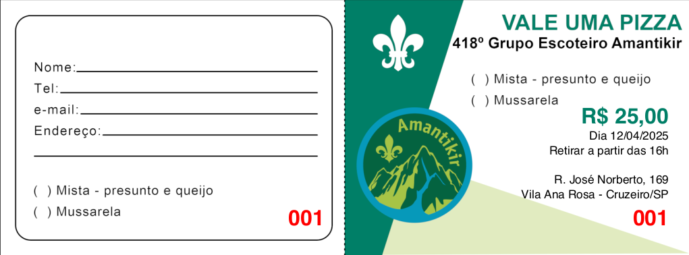

<h1 align="center">🎟️ Pizza Ticket Generator - Vale Pizza 🍕</h1>

<p align="center">
  
  
  
</p>

<p align="center">
  Aplicativo com interface gráfica para gerar tickets de vale-pizza em PDF 🍕 <br>
  Desenvolvido para eventos do <strong>Grupo Escoteiro</strong>.
</p>

---

## 📦 Funcionalidades

✅ Gerar tickets de pizza com layout padronizado  
✅ Definir número de tickets, valor e data  
✅ Personalização com imagem de fundo e fonte customizada  
✅ Interface simples com PyQt5  
✅ Geração rápida de PDF para impressão

---

## 🖼️ Exemplo

<p align="center">
  
</p>

---

## 🚀 Como usar

### 1. Clone o repositório

```bash
git clone https://github.com/joaogerd/pizza-ticket-generator.git
cd ticket-generator
```

### 2. Crie o ambiente Conda (recomendado)

```bash
conda env create -f environment.yml
conda activate pizza-ticket-generator
```

### 3. Ou instale com `pip`

```bash
pip install -r requirements.txt
```

### 4. Execute o aplicativo

```bash
python geraTickets.py
```

---

## 🛠️ Empacotamento com `cx_Freeze`

Para criar um executável local:

```bash
python setup.py build
```

Ou para criar uma AppImage (Linux):

```bash
python setup.py bdist_appimage
```

---

## 📁 Estrutura do Projeto

```
ticket-generator/
├── data/
│   ├── pizza.png              # Imagem de fundo do ticket
│   └── Helvetica-Bold.ttf     # Fonte personalizada
├── geraTickets.py             # Código principal da aplicação
├── setup.py                   # Script para empacotamento com cx_Freeze
├── environment.yml            # Arquivo Conda
├── requirements.txt           # Dependências pip
├── .gitignore                 # Arquivos a ignorar no Git
└── README.md                  # Este arquivo
```

---

## 📥 Download do Executável

> ⚠️ Disponível apenas após empacotamento:

- 🔽 [Download para Linux (AppImage)](https://github.com/joaogerd/pizza-ticket-generator/releases)
- 🔽 [Download para Windows (EXE)](https://github.com/joaogerd/pizza-ticket-generator/releases)

> Acesse a aba **Releases** para baixar.

---

## 💡 Licença

Este projeto está licenciado sob a licença MIT.  
Sinta-se livre para usar, modificar e distribuir com os devidos créditos.

---

## 👨‍💻 Autor

Desenvolvido por **João Gerd Zell de Mattos**.  
Projeto para o Grupo Escoteiro com ❤️.

[](https://www.linkedin.com/in/joaogerd/)
```
